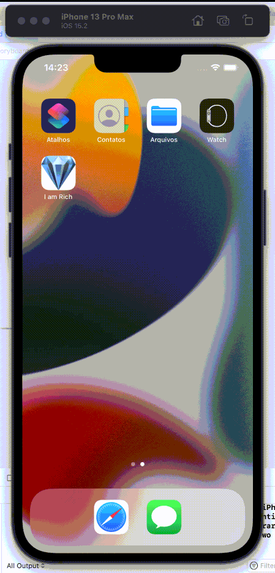

# I am Rich

I am Rich is a very simple project to start my studies using Swift and XCode to create ios mobile apps. Basically, I am Rich has a diamond image, a label with the text "I am Rich" and an application icon configured. The main idea of this app is to simulate the original I am Rich app created several years ago when the first iPhone was annunciated.

## 🔨 Project features

Show a diamond image and a diamond image.

## 🛠️ Open and Run project

**First** open clone this repository using `git clone` command or download the compressed file with source code. **Second**, open `I am Rich.xcodeproj` file with double click and await XCode start. Then, press `command + r` to run the project using some selected simulator or on your physical iPhone.